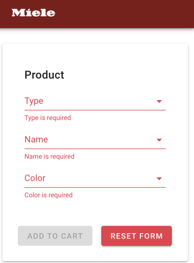

# Ovens, fridges and washing machines

## Mi Solution - Diana Sormani
The project was built using:

* Vue.js
* Vuetify
* Vuex
* Vue router
* vue-test-utils
* Jest
* Font Awesome (for the icons)

The installation is very standard, and here are the usual commands. Underneath these sections, there are details about the implementation, features, architecture, testing and workflow. Here is a sneak peek of the application's **home page** run with the data provided.


## Features
The application provides the following interfaces:

* The **Product Form**: This is a component where the user can select which type, product and color to add to the shopping cart. The form fullfils the requirements:
    - it displays the following drop down menus
      - a list of product types, loaded when data available
      - a list of product names, loaded when data available
      - a list of product colors, available on page load
    - all three lists are enabled when data is available.
    - when selecting an option in on of the list, the other lists are filtered accordingly.
    - at the bottom of the form all selections will be shown.

	

	The form also: 
	- is responsive
	- contains validations. If the required fields are missing, then the "add to cart" button is disabled.
	
	

	

	
* The **Product List** is a component where the user can see all the products already entered via the previous form, into the shopping cart. Every new item is entered on top of the previous list.

	For each product at the cart, the photo, the name and the color are shown.

	


* The **Product Skeleton** is a component where the user can already preview the skeleton of the product form to be shown, once the information is available. This way, the user can already preview something, while the data is fetched. And also, it prevents the user from trying to select data at the Product Form, if it is still not available.

	

* The **Error** view is a page where the user is redirected in case of error while loading the data. Also, it is a safe guard when the user enters an invalidad url. The router will redirect the user to this page too, providing a better user experience. This page also provides a button to redirect the user to the home page.

	

## Architecture and Implementation
The application was built separating:
- the state (on Vuex) where I keep track of:
	- the **products** which is an array that contains all the information retrieved from the service as is.
	- the **productTypes** which is an array containing a list of the types that came from the service. Each element is unique (no duplicates are stored).
	- the **productNames** which is an array containing a list of the names that came from the service.
	- a **loading** flag that indicates whether the application is loading the data at a given time.
	- the **cart** which is an array containing all the products that the user has added via the form.

	The state is only updated via MUTATIONS and accessed by getters. The MUTATIONS are only accessed by ACTIONS.

- the service contain the method that retrieves the product data as provided for the assignment.
- the two main views: 
	- the **Home** view shows 2 different scenarios. If the application is loading, then it shows the __ProductSkeleton__ component which gives the user a preview of what will come once the product list is fully loaded.
	If the application has finished loading, it will show two components: __ProductForm__ and __ProductList__. On the ProductForm, the user can select the type, product and color that he/she wants to add to the cart. 
	On the __ProductList__, the user sees all the products already added to the list. Every new product is added on top of the list.
	- the **Error** view is called whenever there is an error while loading. But also, it is a safe guard when the user enters an invalidad url. The router will redirect the user to this page too, providing a better user experience.


The main methods at the store and main components are mostly documented.


## Testing
The testing was made with **Jest** and **vue-test-utils**. There are 3 test files (due to time restrictions)
- store.spec.js: the store testing I divided into:
	- testing **getters**
	- testing **mutations**
	- testing **actions**

	

- Home.spec.js: the view or components testing I divide into:
	- testing **Template** (including snapshots)¸
	- testing **Computed properties**

	


- Error.spec.js: the view or components testing I divide into:
	- testing **Template** (including snapshots)¸
	- testing **Methods**

	
	
- Testing Coverage:
	


## Project setup
```
npm install
```

### Compiles and hot-reloads for development
```
npm run serve
```

### Compiles and minifies for production
```
npm run build
```

### Run your unit tests
```
npm run test:unit
```

### Lints and fixes files
```
npm run lint
```

### Customize configuration
See [Configuration Reference](https://cli.vuejs.org/config/).
